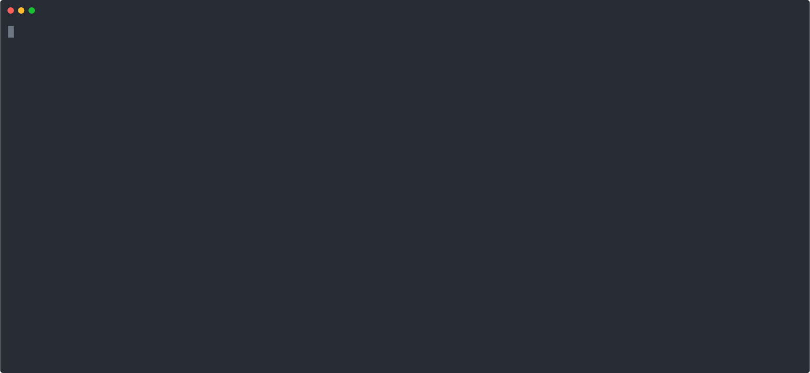

# linux kernel debugging

1. Start arm/arm64 vm instance with additional "-s -S" parameters and wait for debugging.  
for arm
~~~
$HOME/4dotnet/scripts/arm/start-qemu.sh -s
~~~
for arm64
~~~
$HOME/4dotnet/scripts/arm64/start-qemu.sh -s
~~~
2. Run arm-linux-gdb or aarch64-linux-gdb to load the built linux kernel vmlinux.  
for arm
~~~
$HOME/buildroot/output/host/bin/arm-linux-gdb  $HOME/buildroot/output/build/linux-5.12.4/vmlinux
~~~
for arm64
~~~
$HOME/buildroot/output/host/bin/aarch64-linux-gdb  $HOME/buildroot/output/build/linux-5.12.4/vmlinux
~~~  
3. Connect to the remote target as the below and start the kernel debugging as the below
~~~
(gdb) target remote :1234
Remote debugging using :1234
cpu_v7_do_idle () at arch/arm/mm/proc-v7.S:78
78              ret     lr
(gdb) bt
#0  cpu_v7_do_idle () at arch/arm/mm/proc-v7.S:78
#1  0xc02078f4 in arch_cpu_idle () at arch/arm/kernel/process.c:73
#2  0xc024e338 in default_idle_call () at kernel/sched/idle.c:112
#3  cpuidle_idle_call () at kernel/sched/idle.c:194
#4  do_idle () at kernel/sched/idle.c:300
#5  0xc024e6b8 in cpu_startup_entry (state=state@entry=CPUHP_ONLINE) at kernel/sched/idle.c:397
#6  0xc07a66d8 in rest_init () at init/main.c:721
#7  0xc0a0094c in arch_call_rest_init () at init/main.c:849
#8  0xc0a00d54 in start_kernel () at init/main.c:1064
#9  0x00000000 in ?? ()
Backtrace stopped: previous frame identical to this frame (corrupt stack?)
(gdb) info var jiffies_64
All variables matching regular expression "jiffies_64":

File kernel/time/jiffies.c:
77:     static const struct kernel_symbol __ksymtab_get_jiffies_64;

File kernel/time/time.c:
672:    static const struct kernel_symbol __ksymtab_jiffies_64_to_clock_t;

File kernel/time/timer.c:
59:     u64 jiffies_64;
61:     static const struct kernel_symbol __ksymtab_jiffies_64;
(gdb) watch jiffies_64
Hardware watchpoint 1: jiffies_64
(gdb) info br
Num     Type           Disp Enb Address    What
1       hw watchpoint  keep y              jiffies_64
(gdb) c
Continuing.

Thread 1 hit Hardware watchpoint 1: jiffies_64

Old value = 4294958344
New value = 4294958448
0xc02a3434 in tick_do_update_jiffies64 (now=<optimized out>) at kernel/time/tick-sched.c:118
118             jiffies_64 += ticks;
(gdb) list
113                     last_jiffies_update = ktime_add_ns(last_jiffies_update,
114                                                        TICK_NSEC);
115             }
116
117             /* Advance jiffies to complete the jiffies_seq protected job */
118             jiffies_64 += ticks;
119
120             /*
121              * Keep the tick_next_period variable up to date.
122              */
(gdb) bt 10
#0  0xc02a3434 in tick_do_update_jiffies64 (now=<optimized out>) at kernel/time/tick-sched.c:118
#1  0xc02a4400 in tick_do_update_jiffies64 (now=255760400592) at ./include/linux/ktime.h:97
#2  tick_nohz_update_jiffies (now=255760400592) at kernel/time/tick-sched.c:582
#3  tick_nohz_irq_enter () at kernel/time/tick-sched.c:1327
#4  tick_irq_enter () at kernel/time/tick-sched.c:1344
#5  0xc0224128 in irq_enter_rcu () at kernel/softirq.c:385
#6  0xc0224138 in irq_enter () at kernel/softirq.c:396
#7  0xc0274744 in __handle_domain_irq (domain=0xc1010000, hwirq=27, lookup=lookup@entry=true, regs=regs@entry=0xc0c01f28) at kernel/irq/irqdesc.c:674
#8  0xc04b96c8 in handle_domain_irq (regs=0xc0c01f28, hwirq=<optimized out>, domain=<optimized out>) at ./include/linux/irqdesc.h:176
#9  gic_handle_irq (regs=0xc0c01f28) at drivers/irqchip/irq-gic.c:370
(More stack frames follow...)
~~~
